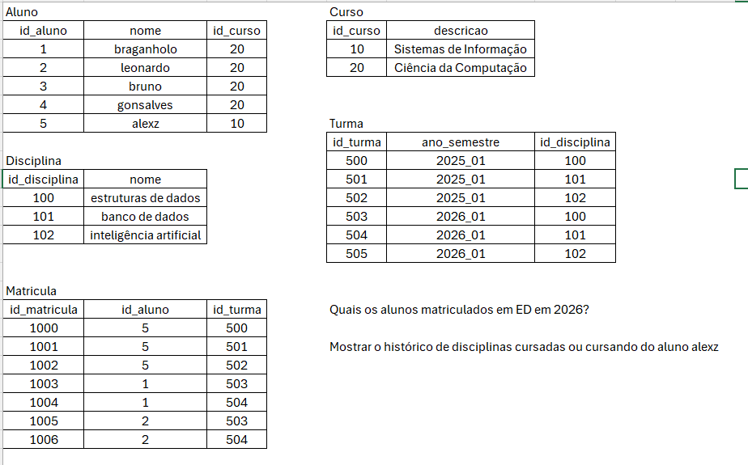

# Exercício 01 — Consultas acadêmicas

## Questões

1. Quais alunos estão matriculados em Estrutura de Dados em 2026?
2. Mostre o histórico de disciplinas cursadas ou em andamento do aluno Alexz.

## Anotações

Quais alunos estão matriculados em ED em 2026?

Select aluno.nome, Curso Descricao
from disciplina, turma, matricula // tabelas do banco
where disciplina.nome == "Estrutura de Dados" and Turma.ano_semestre like "2026%";
disciplina.id_disciplina == Turma.id_disciplina and
turma.id_turma == matricula.id_turma and
matricula.id_aluno == turma.id_aluno and
aluno.id_curso == curso.id_curso;

Mostrar os o histórico de disciplinas cursadas ou cursando do aluno alexz

