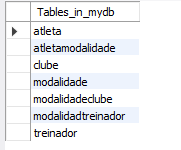

# Exercício 01 — Clubes, modalidades e atletas

responder as perguntas
- Qual o clube que está sem treinador?
- Quais as modalidades que a maria pratica?
- mostre todos os atletas e suas modalidades

"show databases;
use mydb;

show tables;

select *
from atleta;

insert into atleta values (1, "Maria");
insert into atleta values (2, "Pedro");
# insert into atleta (nome) values ("Pedro");
insert into atleta values(3, "Yasmin");
insert into atleta values(4, "Rafael");
insert into atleta values(5,"Daniel");

show tables;

select *
from modalidade;

insert into modalidade values (500, "Beach Tennis");
insert into modalidade values (501, "Padel");
insert into modalidade values (502, "Volei de Areia");

insert into clube values (100, "Star Padel");
insert into clube (nome) values ("Fair Play");
insert into clube (nome) values ("Elite");
insert into clube (nome) values ("8000 Sports");
insert into clube (nome) values ("Pier Beach Tennis");

select * 
from treinador;

insert into treinador values (1000, "Lucas", 100);
insert into treinador values (1001, "Pato", 102);
insert into treinador values (1002, "Jader", 103);
insert into treinador values (1003, "Enrico", 104);

insert into modalidadtreinador values (500, 1002);
insert into modalidadtreinador values (500, 1003);
insert into modalidadtreinador values (501, 1000);
insert into modalidadtreinador values (501, 1001);

insert into atletamodalidade values (1, 500);
insert into atletamodalidade values (1, 501);
insert into atletamodalidade values (2, 500);
insert into atletamodalidade values (3, 502);
insert into atletamodalidade values (4, 502);

insert into modalidadeclube values (500,100);
insert into modalidadeclube values (500,101);
insert into modalidadeclube values (500,103);
insert into modalidadeclube values (500,104);
insert into modalidadeclube values (501,100);
insert into modalidadeclube values (501,101);
insert into modalidadeclube values (501,102);

show tables;
select * 
from clube;
SELECT *
FROM clube
WHERE idClube NOT IN (
    SELECT id_clube 
    FROM treinador 
    WHERE id_clube IS NOT NULL
);

"

Atleta
1, Pedro
2, Maria
3, Yasmin
4, Rafael
5, Daniel

 

Modalidade
500, Beach Tennis
501, Padel
502, Volei de Areia

 

Clube
100, Star Padel
101, Fair Play
102, Elite
103, 8000 Sports
104, Pier Beach Tennis

 

Treinador
1000, Lucas, 100
1001, Pato, 102
1002, Jader, 103
1003, Enrico, 104

 

ModalidadeTreinador
500, 1002
500, 1003
501, 1000
501, 1001

 

AtletaModalidade
1, 500
1, 501
2, 500
3, 502
4, 502

 

ModalidadeClube
500, 100
500, 101
500, 103
500, 104
501, 100
501, 101
501, 102
