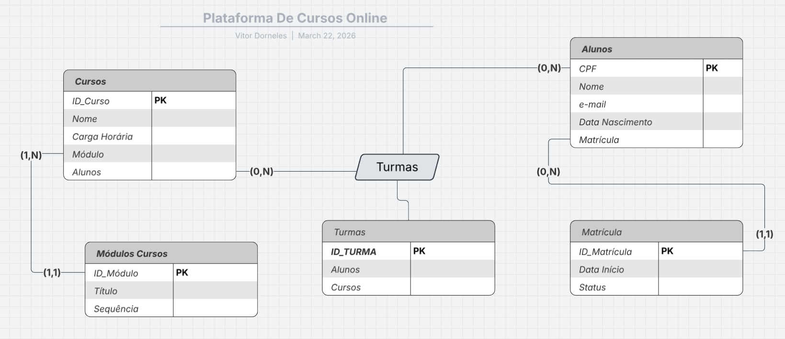

# Exercício 03 — Plataforma de Cursos Online

Uma startup de educação precisa modelar sua base de dados. A plataforma oferece diversos Cursos (nome, carga horária, código). Cada curso é composto por vários Módulos (título, sequência), sendo que um módulo pertence obrigatoriamente a apenas um curso. Os Alunos (nome, e-mail, data de nascimento) se matriculam nos cursos. Um aluno pode estar matriculado em vários cursos e cada curso pode ter milhares de alunos. No ato da Matrícula, é importante registrar a data de início e o status (ativo/concluído).

## Resposta

