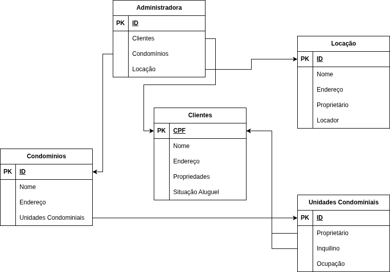

# Exercício 03 — Administradora de condomínios

## Enunciado

Modele um sistema para uma administradora de condomínios que controle:

- condomínios, com identificação, nome, endereço e suas unidades;
- unidades condominiais, incluindo proprietário, inquilino e situação de ocupação;
- clientes, com CPF, nome, endereço, propriedades e situação de aluguel;
- locações, com identificação, nome, endereço, proprietário e locador;
- os vínculos entre a administradora, os condomínios, os clientes, as unidades e as locações.

Defina as entidades, atributos, chaves, relacionamentos e cardinalidades necessários.

## Diagrama

